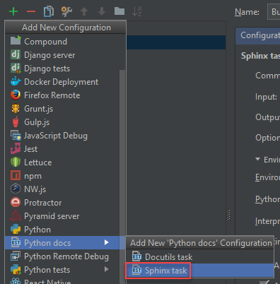
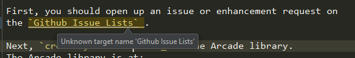
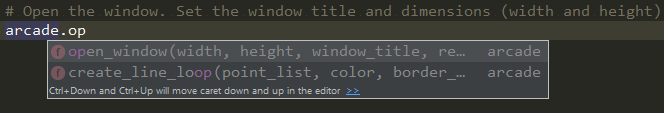
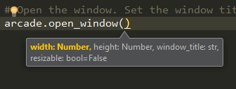
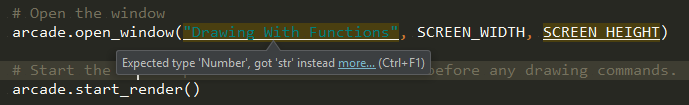
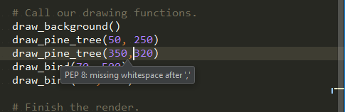
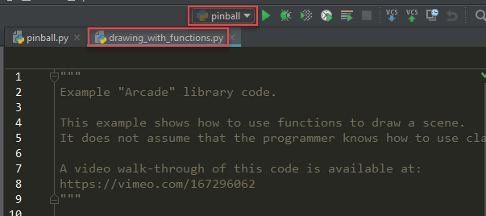

Teaching Python 3.6 with Games
==============================

Introduction
------------

* My goal with this webinar is to share what I've learned teaching students to program
  using Python to create video games, along with a new Arcade library for 2D
  graphics.
* So if you are an educator, or if you work with
  interns and new employees, hopefully you'll find some ideas to try.
* If you are more of a visual learner, or if you want to follow up on anything I'm talking
  about later, you can see my notes for this webinar at:
  http://2017-craven-webinar.readthedocs.io

Background/Overview
-------------------

* I'm a
  `computer science professor <http://simpson.edu/author/pcraven/>`_
  at `Simpson College <http://simpson.edu/computer-science>`_ in Iowa.
* I've taught an *Intro to Programming* class using Python and `Pygame`_ for many years.

  * I created `Program Arcade Games`_, a website, book, and video series to learn programming.
  * Students learn by creating their
    `own video games <http://programarcadegames.com/index.php?chapter=foreword&lang=en#section_0>`_.
  * About 1,800 people use it to learn each weekday during the school year.

* `Pygame`_ got to be a limiting factor to make the curriculum better.

  * Buggy, inconsistent, didn't use new Python 3 features.
  * Students spent too much time learning the 'oddities' of `Pygame`_ when they
    could have been learning more programming.

* Create the `Arcade Library`_

  * Easy library for 2D video games
  * Fix issues with `Pygame`_
  * Faster, OpenGL based
  * Take advantage of Python 3 features like `type hinting`_.

* I have a new version of my on-line book that I'm working on that uses
  the Arcade Library instead of Pygame: `Learn Python with Arcade Academy`_

Tip 1: Revise Your Pedagogy
---------------------------

* Pedagogy_ (how you teach) should be treated like software.

* We keep releasing "learn to program" books, as one-and-done books. This is
  terrible.
* This applies even if you aren't writing a "how to program" book. For example,
  if you are writing docs on your
  in-house software, your docs on your company's development procedures.
* Most books probably haven't even had one set of people go through them
  to learn how to program before being released to market.
* Realize the first release of learning material, just like software, will be terrible.
* Revise your notes. Teach from the materials, find student questions, update it,
  repeat.
* Even the second version will likely be bad. When I create materials, it isn't
  until at least the third version I start being happy with the materials.
* `Don't restart from scratch <https://www.joelonsoftware.com/2000/04/06/things-you-should-never-do-part-i/>`_.
* After 8 years of revisions, 16 semesters of teaching the class, you can
  fine tune a class to a thing of beauty. For example, imagine updating a question where
  you add the text "If you think the answer is zero, go back and reread
  Section 12.3." can save you time, the student time, and you end up with a
  student who understands the material better than last semester's student.
  It is engineering.
* Remember: Any documentation you use watch people use it,
  take notes on how to make it better, and then engineer it.
  Make science out of learning.

Tip 2: Use a Good Tool-Chain for Teaching Materials
---------------------------------------------------

* How do you make this constant revision easy?
* I suggest using Sphinx_. Sphinx is the software used to create the official
  Python documentation. It is a "Static Content Generator."

  * Note, there are a lot of other
    `Static Content Generators`_ out there you can use for your materials.
    I've also tried using a Wiki. I prefer Sphinx for its Python integration.

* Sphinx uses `Restructured Text`_, which is much better than editing HTML
  by hand. You can also make e-books out of it.
* See this example of a Networking class I did:
  https://github.com/pvcraven/networking-class/commits/master
* You can easily build ``.rst`` files using Sphinx in PyCharm with the
  Sphinx task:

* PyCharm is a great editor to type up your restructured text files, as it can
  spell check, auto-complete rst directives, and even
  check and let you know if you have undefined references. You can look up references.

* It is easy to include syntax-highlighted code directly in your materials.
  You can include code snippets, or have the code in separate files.

.. code-block:: python

    print("Simple code snippet")

.. code-block:: rst
    :caption: Including code from a different file

    .. literalinclude:: ../../examples/bouncing_ball.py
        :caption: bouncing_ball.py
        :linenos:

* Store revisions to your materials using Git and a site like GitHub. (Note,
  BitBucket offers free private repositories if you don't want to share
  the source to your materials.)
* Use `Read the Docs`_ to automatically build and host your materials,
  or use cloud hosting.
* The end result:

 * Use any computer to update your teaching materials
 * Work with other developers in your team to keep docs up to date
   using your same in-house VCS.
 * Push the changes and have them automatically built
 * Even use bug/feature tracking to keep track of to-do lists

* If you teach people over-and-over, you'll end up with high-quality materials.

* `Web Development <https://readthedocs.org/projects/web-development-class/>`_
* `Networking <https://readthedocs.org/projects/networking-class/>`_
* `Intro to Programming <https://github.com/pvcraven/arcade_book>`_
* `3D Graphics with Blender <https://github.com/pvcraven/3d_graphics_class>`_

Tip 3: Parameter and Type Hinting
---------------------------------

The beauty of modern editors, is that for most students, you won't even have
to point out that this exists. As soon as you type ``arcade.`` when using an IDE like PyCharm, you get a pop-up
with the `Arcade Library`_ functions. This helps the students quite a bit.

Once you are start typing the function parameters, you also get a pop-up with the parameters and types:

.. note::

    Parameter Names are Important

This means the parameter names have to be good. What might make sense to the library programmer
does not always make sense to the new programmer trying to figure use the library.

I've spent time time tuning the parameter names for the Arcade Library based on my in-person observations of what
names seem to work best with students figuring out the library.

If you type the parameters incorrectly, you'll get an warning before you get any further:

The Arcade Library specifies parameter types using the new `type hinting <https://docs.python.org/3/library/typing.html>`_
conventions introduced in Python 3.5 via `PEP 484`_ and `PEP 526`_.

.. _PEP 484: https://www.python.org/dev/peps/pep-0484/
.. _PEP 526: https://www.python.org/dev/peps/pep-0526/

The numbers_ and typing_ modules in Python help support type hinting.
The code to implement type hinting in the Arcade Library looks like this:

.. _numbers: https://docs.python.org/3.6/library/numbers.html
.. _typing: https://docs.python.org/3.6/library/typing.html

.. code-block:: python

    def open_window(width: Number, height: Number, window_title: str, resizable: bool = False):

In short, I've found these PyCharm features to be very effective with new programmers:

* Pop-up lists of functions.
* When typing a function, having the IDE pop up a
  list of good parameter variable names.
  IDE choice aside, it is important that the parameter names proven understandable as shown by actual experience
  observing programmers new to the library.
* Type hinting. Get some of the advantages of `strong typing`_ without the hassle of requiring new programmers to declare
  variables before using them. (If you've forgotten the difference between strong, weak, dynamic, and static typing,
  I suggest a quick review.)

.. _strong typing: https://stackoverflow.com/questions/2690544/what-is-the-difference-between-a-strongly-typed-language-and-a-statically-typed

.. note::

    I hope someday we will also see docs for functions as you type them. Or a link to the HTML docs.

Students often treat the type hinting warnings as errors rather than warnings. This helps a lot with new programmers
because they figure out their errors as they do the initial coding, rather than trying to figure out why a 500 line program
doesn't work after they've coded it.

Tip 4: Show Students the Linter
-------------------------------

Stereotypically, programmers are shown with terrible clothing style choices. In reality, we are all about style.
Style of our code. For Python, this is all defined in `PEP-8`_.

.. _PEP-8: https://www.python.org/dev/peps/pep-0008/

This might catch new programmers off-guard. A person might celebrate that feeling of accomplishment when their
algorithm works. But get discouraged with the teacher nit-picks their program's style. New programmers often
have issues with:

* Inconsistent indentation
* Forgetting to put spaces after commas
* Huge sections of blank lines in the middle of their program
* No blank lines in their program

In my experience:

* Feedback after-the-fact on style issues is mostly ignored, and if it isn't ignored it just serves to discourage
  students.
* Asking students to run a linter before turning in their program is just an extra step that they often skip.

I like Python because it is not so rigid as to discourage new programmers. But I do want to encourage
new programmers to learn and adhere to programming standards.
With pop-up warnings in the code, we get the best of both worlds. Here is what PyCharm does:

Since it comes from the editor, it seems more "official" than coming from the instructor. It also feels less
like a personal insult to their intelligence.
Poor students who don't care about programming can still ignore it. Average to good students can pay attention and write
code that conforms to style guidelines.

In my experience, once students got PEP-8 warnings in their editor, the percent of student code that adhered to style
guidelines improved.

.. literalinclude:: examples/tip_03_04.py
    :caption: bouncing_ball.py
    :linenos:

Tip 5: Making IDEs Easier
-------------------------

Text editors are simple. Students write a file, and then run the file.

IDEs are more complex. The most common issues for new students:

* Students must create a project, then add the files to the project. Some
  students have difficulty with this concept, and even basic file/folder
  management. If a student just wants to run a two-line ``for`` loop example,
  forcing her to create a project to run it is crazy.
* Configurable IDEs have a lot of tool windows and other things that can be
  messed up, making it difficult for a student to get back to the state where
  they match the instructor's setup.
* Students often run the wrong program:

However, the trade-off for this complexity:

* Code-completion
* PEP-8 Linting
* Type hinting
* Spell checking
* If an error occurs, the IDE points right at the error without needing to
  decode a stack trace.

For many years I was in the "text editor" camp. This last year, after seeing
the improved code quality with the PEP-8 linting, I'm in the IDE camp.

To mitigate the issues with forcing a project on the student, we create
*one* project to use for the *whole* class. Students start with a pre-defined
set of folders. There is one folder for each lab, and a folder for "scratch"
code that students can store quick examples in.

Tip 6: Teach Students to Search for Code Examples
-------------------------------------------------

Real-life programming rarely involves writing code from scratch. In fact, feedback we get from recent alumni
is that they had not enough experience programming with large pre-existing project.

To help teach this, I provide a lot of code samples:

http://arcade.academy/examples/index.html

Don't just give students one example and step through it. That's a snooze-fest. Give lots of example code that
form building blocks. Make it easy to navigate. Then give tasks that requires students to go through those
code samples and build their own program.

Tip 7: Show Students API Docs
-----------------------------

Don't just show students how to program from your materials. Make it a point to show them the API docs. Have
them look up functions out of the API docs and use them:

http://arcade.academy/quick_index.html

Tip 8: Explain IDE Features As You Use Them
-------------------------------------------

* Moving lines up and down
* Indent/unindent blocks of code
* Multi-cursor
* Go to definition

Results
-------

Playlist with some of the games:

https://www.youtube.com/playlist?list=PLUjR0nhln8ub1tPayFjz7w-LCTQ_gYs7V

Note that these aren't paint-by-number programs. There is a lot of creativity in what the students have put together.

Here is a breakout program that a student did:

.. raw:: html

    <iframe width="560" height="315" src="https://www.youtube.com/embed/08dgcomrB68" frameborder="0" allowfullscreen></iframe>

The code mostly passes the linter check, and for a first-semester programming student is
a rather impressive feat:

.. literalinclude:: example.py
    :caption: example.py
    :linenos:

.. _Pygame: http://pygame.org
.. _Program Arcade Games: http://ProgramArcadeGames.com
.. _Pedagogy: http://www.dictionary.com/browse/pedagogy
.. _Arcade Library: http://arcade.academy/
.. _type hinting: https://docs.python.org/3/library/typing.html
.. _Sphinx: http://www.sphinx-doc.org/en/stable/
.. _Static Content Generators: https://www.staticgen.com/
.. _Read the Docs: https://readthedocs.org/
.. _Restructured Text: http://www.sphinx-doc.org/en/stable/rest.html
.. _Learn Python with Arcade Academy: http://arcade-book.readthedocs.io/en/latest/